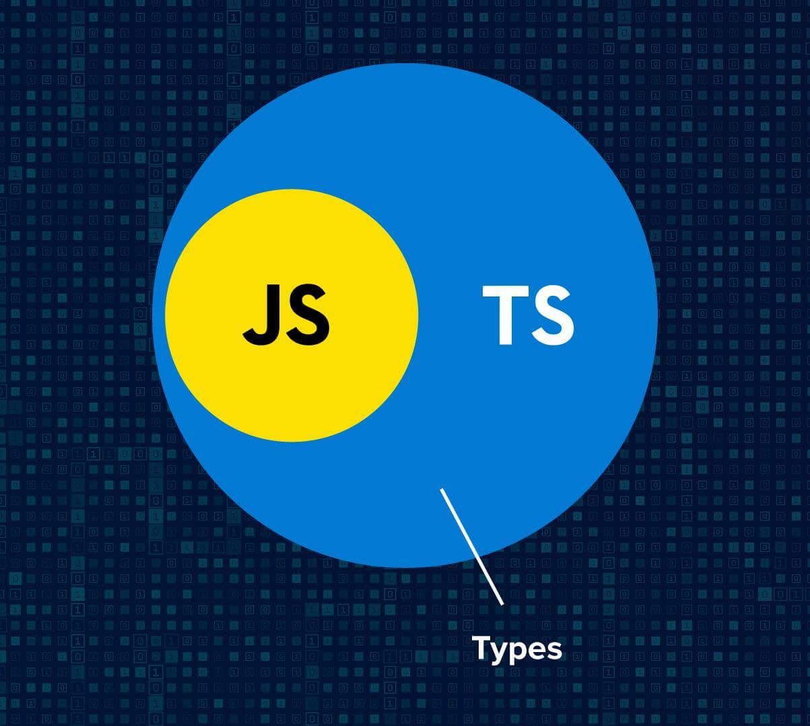

# 타입스크립트와 자바스크립트의 관계 이해하기

> 타입스크립트는 자바스크립트의 상위 집합(superset)이다.

자바스크립트 사용자라면 다들 한 번쯤은 들어봤을 것이다. 자바스크립트는 왜 타입스크립트의 상위 집합일까?

간단한 이유는, **자바스크립트 확장자(.js, .jsx)에서는 타입스크립트 문법을 사용할 수 없지만, 타입스크립트 확장자(.ts, .tsx)에서는 자바스크립트 문법을 사용할 수 있다는 점**이라고 할 수 있다.  
이렇게 타입스크립트가 자바스크립트를 포함한다는 것은 자바스크립트에서 타입스크립트로 마이그레이션할 때 매우 큰 이점이라고 할 수 있다.
코드에서 개발자 자신이 원하는 부분에만 타입스크립트 적용이 가능하기 때문이다.

---

또한, 타입스크립트 컴파일러는 타입스크립트 뿐만 아니라 자바스크립트에서도 유용하다.

```ts
let helloUpper = 'hello';
console.log(helloUpper.touppercase());
// touppercase 속성이 없는 것을 알아냄
// 'toUpperCase'를 사용하시겠습니까?
```

helloUpper이 문자열인 것을 알려 주지 않았다. 그러나 **ts 컴파일러는 초깃값으로부터 타입을 추론**한다.

타입 시스템의 목표 중 하나는 **런타임에서 오류를 발생시킬 코드를 찾아내는 것**이라고 할 수 있다. 물론 타입 체커가 모든 오류를 찾아낼 순 없다. 따라서 우리는 타입 체커가 잘 작동하도록 타입 구문을 추가하고, 코드의 동작과 의도를 명확히 작성해야 한다.

```ts
function checkNumberType(number: number): string {
  if (number > 0) {
    return '양수';
  } else if (number < 0) {
    return '음수';
  } else {
    return '0';
  }
}

console.log(checkNumberType(-3)); // 출력: 음수
console.log(checkNumberType(0)); // 출력: 0
console.log(checkNumberType('asdf'));
//Argument of type 'string' is not assignable to parameter of type 'number'.
```

그렇다. 타입을 추가하게 된다면 우리는 타입 체커에게 코드의 의도를 알려줄 수 있게 된다.

또한, 타입스크립트 타입 시스템은 자바스크립트의 런타임 동작을 모델링한다. 그러나 자바스크립트의 특성 때문에 이상한 코드가 타입 체커를 통과하여 에러가 나기도 한다.

```ts
const a = 2 + '5'; // string타입, 정상
const b = [] + 9; //Operator '+' cannot be applied to types 'never[]' and 'number'.
const name = ['hun'];
console.log(name[3].toUpperCase());
// cannot read property 'toUpperCase' of undefined
```

예시이다.

a의 경우 숫자와 문자를 더하면 숫자가 문자로 형변환되어 문자 더하기가 되는 js의 특성 때문에 정상으로 취급되고, b의 경우는 9가 출력이 되지만 타입 체커에서는 이상한 코드로 생각하기에 에러를 발생시킨다.

또한 name에서는 타입스크립트는 범위 내의 배열에서 변수가 사용될 것으로 생각했지만 배열을 벗어났기 때문에 오류가 발생하였다.

위같은 결과들을 타입스크립트가 잡을 수 없는 이유는 **애초에 타입 시스템은 정적 타입의 정확성을 보장하기 위한 것이 아니기 때문**이다.

---
