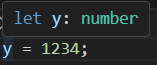
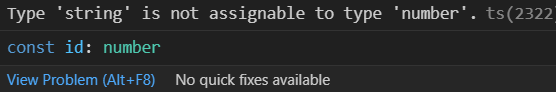

# 추론 가능한 타입을 사용하기

### 타입스크립트는 타입을 위한 언어이다. 그런데 모든 변수에 타입을 선언하는 게 현명한 선택일까?

```js
let x: number = 1234; // 불필요
let y = 1234;
```

다음과 같이 코드의 모든 변수에 타입을 선언하는 것은 불필요하다.



실제로 vscode를 보면 이미 number로 선언이 되어 있는 것을 확인할 수 있다.
즉, 타입 추론이 된다면, 명시적 타입 구문은 필요하지 않다.

```js
const asd = '1';
const asdf: string = '1';
```

여기서 asd는 타입이 '1' 이고, asdf는 string이다. 우리는 asd 변수를 string으로 예상하기 쉽지만, ts가 추론한 '1' 이 더 정확하다.

타입이 추론된다면 리팩토링 또한 용이해진다.

```js
interface Product {
  id: number;
  name: string;
  price: number;
}

function logProduct(product: Product) {
  const id: number = product.id;
  const name: string = product.name;
  const price: number = product.price;
  console.log(id, name, price);
}
```

이렇게 Product 타입을 가정해 보자.

그런데 id에 string도 들어갈 수 있다는 걸 알게 되었을 때, Product의 id 타입을 수정하게 되면 logProduct 내의 id 변수 선언에 있는 타입과 맞지 않아 오류가 발생한다.



함수 내에서 명시적인 타입 구분을 하지 않았더라면 코드는 타입 체커를 수정 없이 통과할 수 있었을 것이다.

그러나 저렇게 사용하기에는 너무 번거롭다. 따라서 비구조화 할당문을 사용하여 구현하는 것이 낫다.

```js
function logProduct(product: Product) {
  const { id, name, price } = product;
  console.log(id, name, price);
}
```

이를 통해 모든 지역 변수의 타입이 추론되도록 할 수 있다.

정보가 부족할 땐 타입스크립트 스스로가 타입을 판단하기 어려운 경우가 있을 수 있다. 이럴 때 명시적 타입 구문이 필요하다. product가 그 예이다.

이상적인 타입스크립트 코드는 함수, 메서드 시그니처에 타입 구문을 포함하지만 함수 내에서 생성된 지역 변수에는 타입을 넣지 않는다.

이렇게 타입 구문을 생략함으로서 읽는 사람이 구현 로직에 집중할 수 있도록 하는 것이 좋다.
